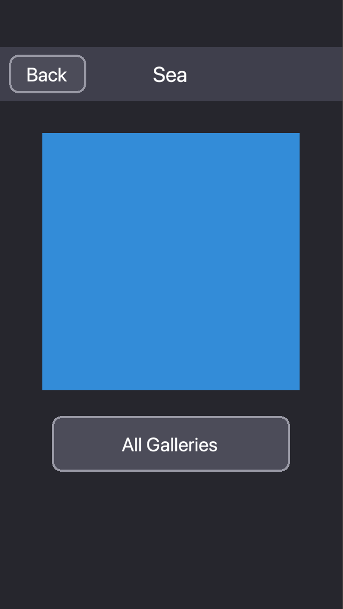

# Examples

Each folder is a complete Solar2D project with its own copy of the library: open its `main.lua` in the Solar2D Simulator.

| | |
|---|---|
|  | **dmc-navigator-simple**: browse galleries of images (colored squares). Tap a gallery, then an image: each page slides in from the right, and the title bar above the navigator shows its title. Back pops a page (`popViewAnimated()`), All Galleries goes back to the first one (`popToRoot()`), and the app removes each view in the `REMOVED_VIEW` handler. The pages are [dmc-objects](https://github.com/dmccuskey/dmc-objects) components, in `views/`. |
